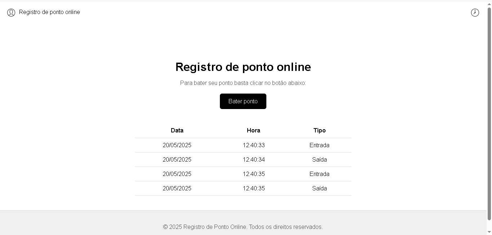

# 🕒 Registro de Ponto Online

Aplicação simples de registro de ponto online, desenvolvida em HTML, CSS e JavaScript. O objetivo é permitir que usuários registrem entradas e saídas com data e horário em uma tabela na tela.

## 🚀 Funcionalidades

- Registro de ponto com um clique
- Armazena data, hora e tipo (Entrada/Saída)
- Design responsivo e moderno (baseado no layout do Figma)
- Interface intuitiva e minimalista

## 📸 Preview

 

## 🛠️ Tecnologias utilizadas

- HTML5
- CSS3 (com media queries para responsividade)
- JavaScript (vanilla)

## 💡 Como usar

1. Clone o repositório:

```bash
git clone https://github.com/seu-usuario/registro-ponto.git
